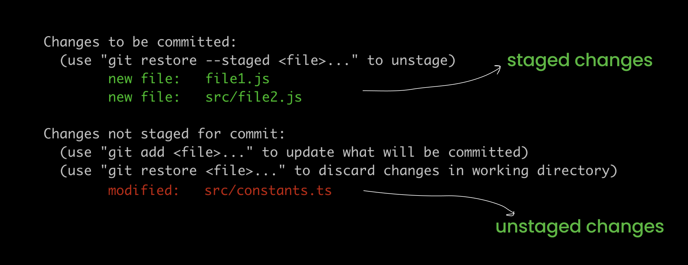

One of the most common concepts you'll hear in Git is "staged changes". Or you may have heard it as "staging area". What does this mean?

When you make a change in some files in your project, the next thing you want to do is "commit" that change. Committing the change means creating a new "version" of your project which contains the changes that were made. This way, you can revise the changes later on.

Committing a change requires two phases:

1. Adding changes to the staging area
2. Taking a snapshot of the staging area

## Adding changes to the staging area

In the first step, you add the files (which contains the changes) that you want to be part of your next commit. This is done with the `git add` command. You can either add specific files:

```bash
git add file1.js demos/file2.py
```

Or, if would like to commit all the changes you have made in your project, you can add every file like this:

```bash
git add .
```

The period sign indicates "all files in this project". This way, git will capture all files with new changes.

These new files (with changes) you have added will be saved in the **staging area**. You can also call them **staged changes**, that is, the changes that have been staged.

Here's a screenshot showing the staging area of my git project after doing some `git add`s:



I got this by executing `git status` which shows the current state of my git project.

In this screenshot, you see that I've made changes in three files: `file1.js`, `src/file2.js` and `src/constants.ts`. But I've only added two changes to the staging area, which are `file1.js` and `src/file2.js`. As you can see at the top, it says "Changes to be committed". Those are the changes that I have specified to be part of my next commit.

Below the staged changes, you see "Changes not staged for commit". These changes are not in the staging area, so when I create a commit now, they will not be captured in the snapshot. In this area, you see `src/constants.ts`

## Taking a snapshot of the staging area

Moving on to the next step, taking a snapshot. Taking a snapshot means committing your changes.

You take snapshots using the `git commit` command. Here's one way to use it:

```bash
git commit -m "a message here"
```

The purpose of the message is to help you remember the changes contained in that snapshot. An example message can be "update copyright date in footer", which means, the changes contained there, would update the copyright date in footer. It helps everyone (including you) remember what you did (or what you attempted to do).

When you attempt a snapshot, git looks into the staging area. It doesn't check your whole project for changes--it only checks the staging area for changes which you have specified to be part of the next commit.

If it sees some changes in that area, it takes a snapshot, which is recorded as a commit (with a commit id, and other details). You can also call this a "new version" of your project.

But if git does not see any changes in that area, you get an info in your terminal like: **no changes added to commit**. This info means that, "there are no changes in the staging area". Maybe you have changes in your project, or not, but after looking into the staging area and finding nothing, git tells you it doesn't see any changes to take a snapshot of.

## Recap

So, staged changes; these are changes that you have "staged" (specified, prepared) for the next commit. When you attempt to make a commit, git checks the staging area for the specified changes that would be part of that commit. If it finds some changes there, it adds those changes to the commit. If it doesn't find any change there, it informs you that there are no (staged) changes to commit.

I hope this explains the term for you. Kindly share if helpful :)