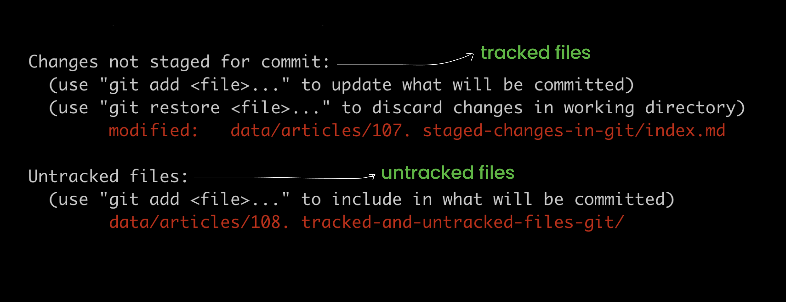

When using Git in your projects, you need to understand what tracked and untracked files are.

Git does not keep a record of the history of all your files until you tell it to. Let's say you have an existing Git project, and you create a new file with some changes. At this point, Git does not have any information about this file. So if you make changes, rename it, or delete it, Git would not be able to show the previous history of the file. The reason for this is that this new file is **untracked**.

While writing this article, I had to create a new file in my project. When I run `git status` in my project with this new file, here's what I get in the console:



From this screenshot, you see we have two sections: "Changes not staged for commit" and "Untracked files"

## Tracked files

We have the first section which is **Changes not staged for commit**. These are tracked files--files Git has recorded a history of. So Git knows that these files have changed since the last time they were committed. A change can be that the file was modified, renamed, or deleted. In my project, the only tracked file that has changed is `data/articles/107. staged-changes-in-git/index.md`, and you see the state close to it which is **modified**.

Tracked files are files that Git is aware of. This way, Git can keep track of the changes or commits related to this file, and you can revert to previous versions of the file.

## Untracked files

The second section is **Untracked files**. This section shows the files in my project that Git does not track currently. This means it will not keep a history of the changes in this file and the subsequent changes. In my project, the only untracked file is `data/articles/108. tracked-and-untracked-files-git/` which is the file I created for this article I'm writing.

The only way to inform Git to keep a record of this file's history is to add the file to the list of tracked files.

## How to track a file in Git

Making a file tracked is easy. You can run a `git add` (which adds it to [the staging area](/p/staged-changes-in-git/)), and then you commit the change. Here are the commands for that using the new file I created in my project:

```shell
git add data/articles/108.\ tracked-and-untracked-files-git/
git commit -m "add new article"
```

By committing this change, Git becomes "aware" of the existence of this file. Now if I make a change to this file and I run `git status`, here's the result I get:


As you see in the result, Git does not see any untracked files anymore. All files in this project are being tracked. If you look at the tracked section now, we see `data/articles/107. staged-changes-in-git/index.md` and `data/articles/108. tracked-and-untracked-files-git/index.md` (the new file I created earlier), and Git sees that these files have been modified (the contents have been updated).

