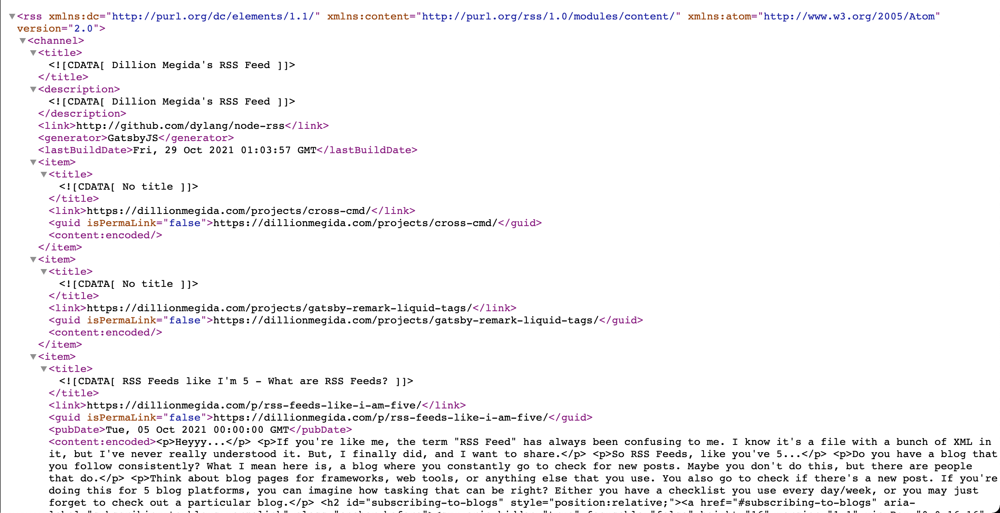

Heyyy...

If you're like me, the term "RSS Feed" has always been confusing to me. I know it's a file with a bunch of XML in it, but I've never really understood it. But, I finally did, and I want to share.

So RSS Feeds, like you've 5...

Do you have a blog that you follow consistently? Or maybe a newsletter? What I mean here is, a blog where you constantly go to check for new contents. Maybe you don't do this, but there are people that do.

Think about blog pages for frameworks, web tools, or anything else that you use. You may go to check if there's a new post. If you're doing this for 5 blog platforms, you can imagine how tasking that can be right? Either you have a checklist you use every day/week, or you may just forget to check out a particular blog.

## Subscribing to blogs

A solution for this now is, instead of having to always check for new posts, you can subscribe to a blog (if that kind of subscribe form is provided). This way, when there's a new post, you'd get an email and you can preview it.

But here are two cons of this method:

- "if that kind of subscribe form is provided"...It's common for newsletters to have a subscribe form but for blog pages, you'd agree that they don't always have (well at least in my experience).
- your email can be literally litterred with many updates of new posts, and it can be difficult to follow or keep track

Now here comes RSS Feeds...

## RSS Feeds, your desired contents in one place

RSS Feeds stand for Really Simple Syndication Feeds.

RSS feeds makings content management easier. Are you interested in following up 5 newsletters, 6 blog pages or 10 contents whatsoever? As long as the platforms on which these contents exist are RSS-compatible, you can subscribe to them all. And when you do that, you can view all the contents you've subscribed for in one place.

When you subscribe, you don't just get notified of new posts, you also get notified of updated posts (like when a section in an article changes--sometimes a post changes and you have absolutely no idea). Depending on the platform you use to view the RSS Feeds, you can easily identify blogs/newsletters that have new posts.

Here's what a RSS feed looks like:

This is an example of the RSS Feed of my website (yes, I added them just before starting this article 😅). Check it out [https://dillionmegida.com/rss.xml](https://dillionmegida.com/rss.xml).

This is gibberish if you ask me. What do you do with all these XML nonsense? And that's where RSS Feed Viewing tools come in. We'll see that in the next section

It's worthnothing RSS Feeds are not just for blogs or newsletters. I used these examples because I felt that's what you'll relate to the most to understand this article.

RSS Feeds can be used for any kind of content. On a basic level, as an author of the feed, you're saving the title, date, URL and maybe description of your contents on the feed. When one of your contents is updated, there's an updated at date saved to it, and that helps to know what's new.

It's also important to know that when you view RSS Feeds, you only have access to what the author made available to the feed.

## RSS Feed Viewer

Gibberishes can be hard to understand. And that's why Feed viewers exist. There's many of them, but here's one you can try out for free (even without entering your email): [RSS Feed Chrome Extension](https://chrome.google.com/webstore/detail/rss-feed-reader/pnjaodmkngahhkoihejjehlcdlnohgmp/related?hl=en)

Install it on your Chrome and you test along with me.

With the extension installed, when you open an RSS Feed of any platform ([my website's for example](/rss.xml)), you may get this modal:

Click Subscribe and now you have one subscribed RSS Feed. When I click on the extension in my browser, here's how it looks:

...

When I click the plus sign, it takes me to the dashboard which looks like this:

...

Note that to get to this dashboard normally, you'd need to sign in on [feeder.co](https://feeder.co). But by clicking on the + sign, it takes me to the dashboard without having to sign in. Actually, it uses a `ctx=extension` param in the URL to know that I'm opening the viewer in the context of the extension installed.

When you click on "All Posts", you get this:

...

(I'm literally testing as I'm writing this article ...haha)

Now, I'm going to make an update to [this article on "Your new Developer Advocate 🥑, My New Career move 💪"](/p/developer-advocate-journey/), basically adding an extra drumroll at the beginning, push to production and see what happens with the extension...

...

this article is not yet complete (grammar-wise, detail-wise)...i'm trying to experiment the RSS feeds, since I have to wait 2hrs to get an update : )
